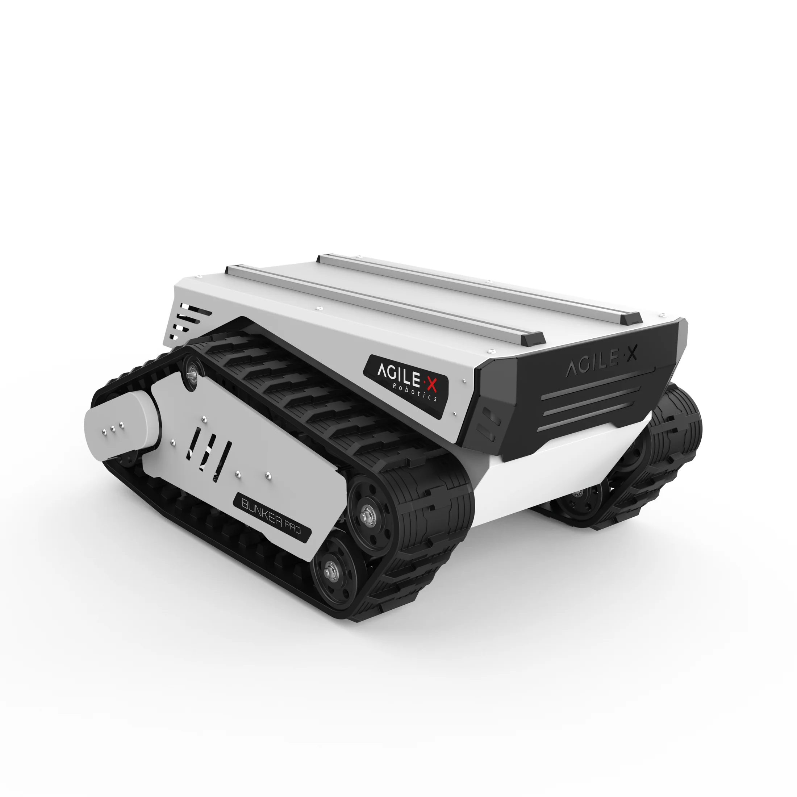
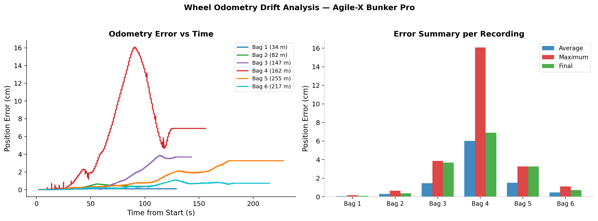
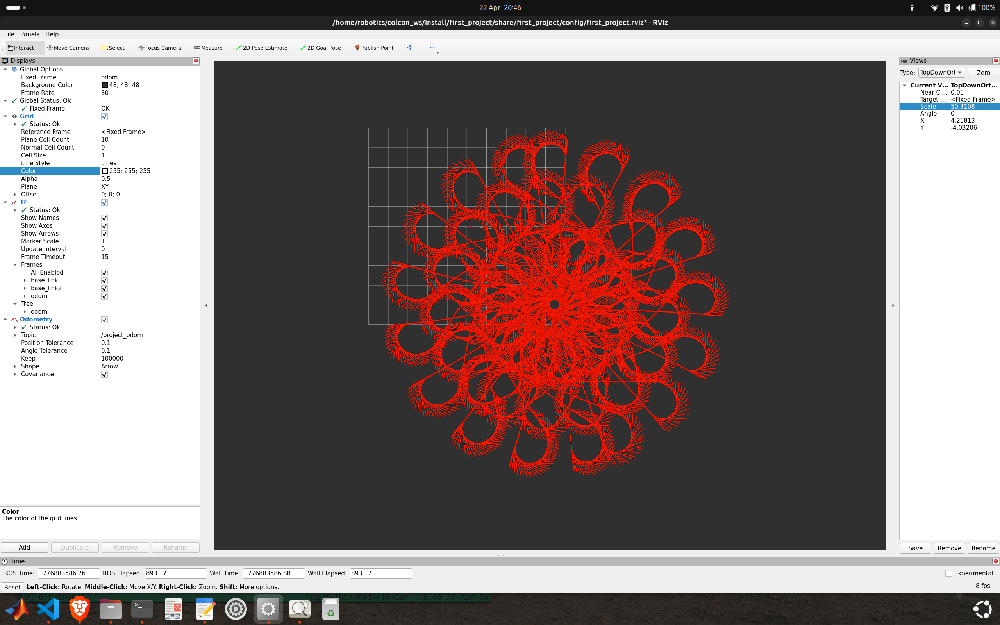
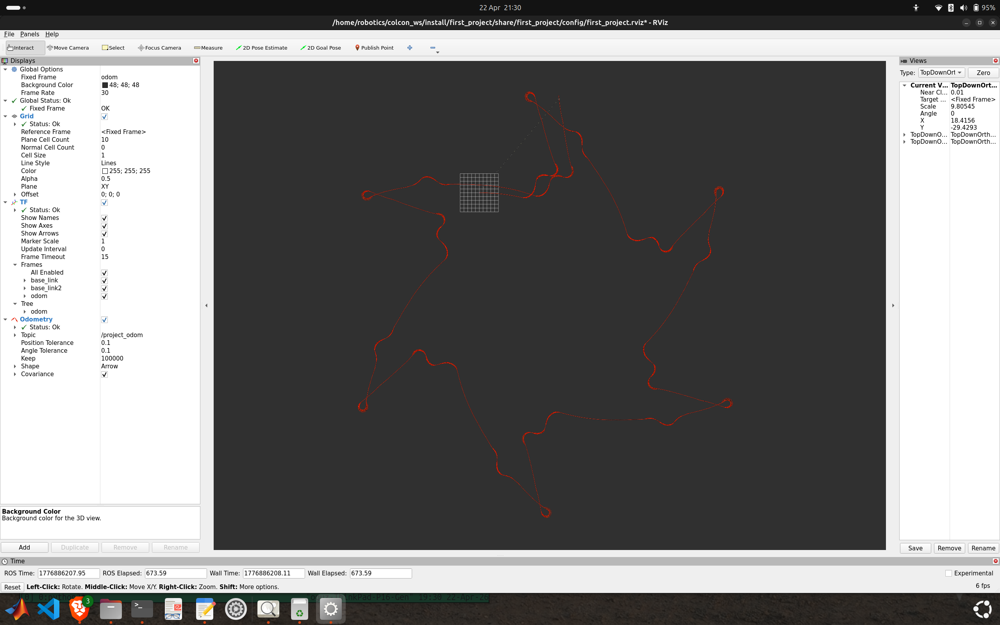
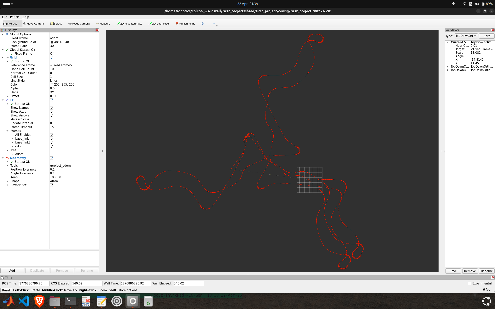
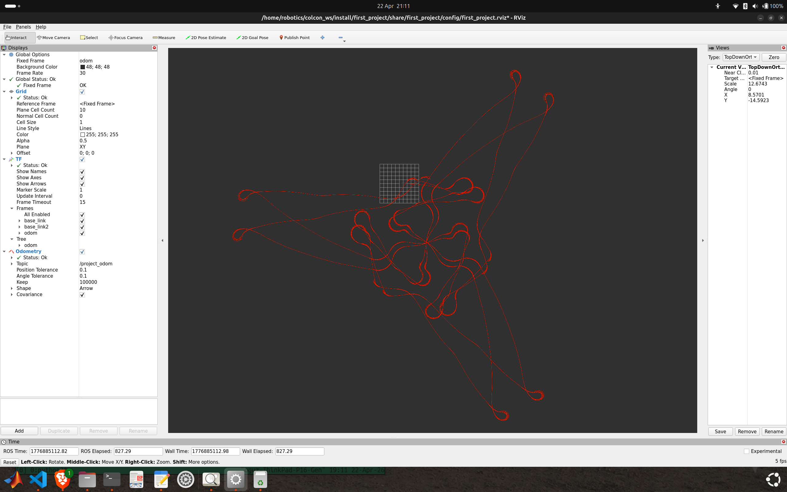
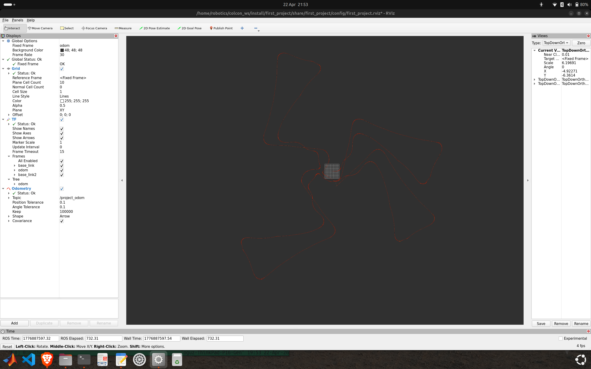
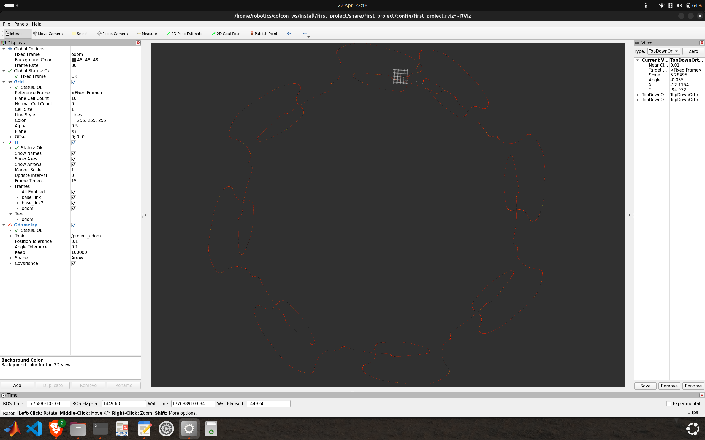

# Bunker Odometry — ROS2

Wheel odometry implementation for the **Agile-X Bunker Pro**, a tracked skid-steering robot, built with **ROS2 Humble** in C++.

The system integrates wheel velocities to estimate the robot's 2D pose, broadcasts it as a TF transform, and evaluates localization error against ground truth in real time.



---

## What it does

- Subscribes to `/bunker_status` and integrates skid-steering kinematics at every callback
- Publishes pose as `nav_msgs/Odometry` on `/project_odom`
- Broadcasts `odom → base_link2` TF transform continuously
- Compares estimated pose against ground truth (`odom → base_link`) every 100ms
- Publishes live error metrics via a custom `TfErrorMsg` message
- Exposes a `reset` service to zero out the odometry state

---

## Robot

**Agile-X Bunker Pro** — compact tracked robot, skid-steering kinematics
Max speed: 1.5 m/s | Track width: 785 mm

---

## Stack

| Tool | Version |
|---|---|
| ROS2 | Humble |
| Language | C++ |
| Build system | colcon / ament_cmake |
| Visualization | RViz2 |

---

## Package structure

```
first_project/
├── src/
│   ├── odometer.cpp          # Odometry node
│   └── tf_error.cpp          # Error computation node
├── msg/
│   └── TfErrorMsg.msg        # Custom message
├── launch/
│   └── first_project.launch.py
├── config/
│   └── first_project.rviz
├── CMakeLists.txt
└── package.xml
```

---

## How to run

**1. Clone and build**
```bash
cd ~/colcon_ws/src
git clone https://github.com/oguzissik/bunker-odometry-ros2.git
cd ~/colcon_ws
colcon build --packages-select first_project
source install/setup.bash
```

**2. Play a bag file**
```bash
ros2 bag play <bag_name> --clock
```

**3. Launch**
```bash
ros2 launch first_project first_project.launch.py
```

---

## Nodes

### `odometer`

Subscribes to `/bunker_status` and integrates skid-steering kinematics:

$$x \mathrel{+}= v_x \cdot \cos\theta \cdot \Delta t$$
$$y \mathrel{+}= v_x \cdot \sin\theta \cdot \Delta t$$
$$\theta \mathrel{+}= \omega_z \cdot \Delta t$$

Publishes pose as `nav_msgs/Odometry` and broadcasts the `odom → base_link2` TF transform. Initializes pose from ground truth TF on startup to eliminate initial offset error.

### `tf_error`

Looks up both `odom → base_link` (ground truth) and `odom → base_link2` (estimated) every 100ms and computes:

$$\text{error} = \sqrt{(x_{GT} - x_{odom})^2 + (y_{GT} - y_{odom})^2}$$

Publishes results as `TfErrorMsg` containing error, elapsed time, and total travelled distance.

---

## Results

Drift analysis across 6 recorded bag files — each with different robot motion patterns:



Error ranged from **0.9mm average** (short, simple trajectory) to **60mm average** (aggressive turning sequences). The dominant factor was not distance travelled — it was turning behavior. Sharp rotations cause track slip, which introduces angular error into the heading estimate. Every subsequent motion compounds that error into positional drift.

### RViz trajectories

| Bag 1 | Bag 2 |
|---|---|
|  |  |

| Bag 3 | Bag 4 |
|---|---|
|  |  |

| Bag 5 | Bag 6 |
|---|---|
|  |  |

---

## Course

Robotics & Perception, Localization and Mapping — Politecnico di Milano
MSc Automation and Control Engineering
